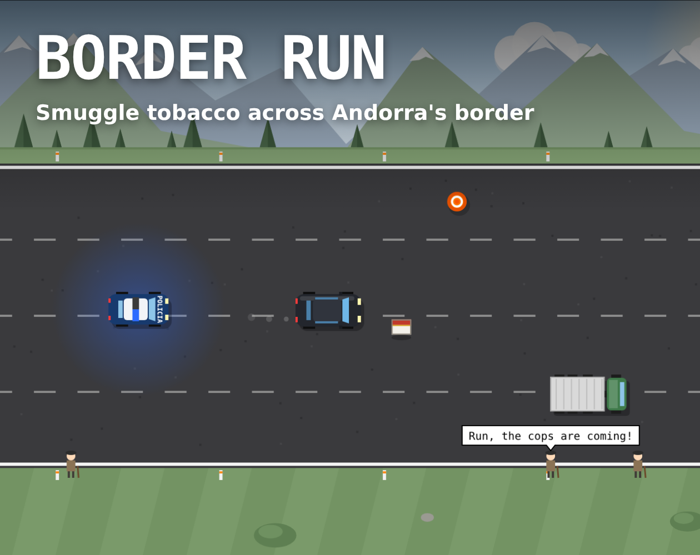

# Border Run

<p align="center">
    <a href="https://edulazaro.itch.io/border-run"></a>
    <a href="https://github.com/edulazaro/border-run/actions/workflows/tests.yml"></a>
    <a href="https://github.com/edulazaro/border-run/blob/main/package.json"></a>
    <a href="https://react.dev"></a>
    <a href="https://www.typescriptlang.org"></a>
    <a href="https://github.com/edulazaro/border-run/blob/main/LICENSE.md"></a>
</p>

Endless arcade runner about tobacco smuggling on Andorra's CG-1 road. Pick up tobacco cartons, deliver them at the drop-off van and keep the police off your tail while dodging trucks and traffic cones, as the old men by the road share their opinions.



**[Play it in your browser on itch.io](https://edulazaro.itch.io/border-run)**. Works on desktop and mobile, in English, Spanish and Catalan.

## How to play

| | Desktop | Mobile |
|---|---|---|
| Drive | Arrows or WASD | Drag your finger anywhere |
| Pause | P or Esc | Pause button |
| Mute | M | Sound button |

- Up to 8 cartons fit in the trunk, but with more than 4 the car slows down.
- The drop-off van appears in the top lane when you carry tobacco: every delivered carton adds 150 m.
- The police chase you for a while, then give up. They swerve around trucks and cones, but sometimes crash and leave the wreck on the road.
- Every 2,500 m you go up a level: faster, more traffic, and one more police car every two levels (two from level 3, three from level 5).
- Hitting a truck, a cone or the police ends the run.

On phones the game plays fullscreen in landscape.

## Development

Requires Node 24 and pnpm.

```bash
pnpm install
pnpm dev          # web page version at http://localhost:5302
pnpm dev:itch     # itch.io version (only the game, filling the viewport)
pnpm check        # types + lint/format (Biome) + tests (Vitest)
pnpm build        # production build in dist/
pnpm build:itch   # dist-itch/ and border-run-itch.zip, ready to upload to itch.io
```

## Project structure

```
src/
  game/      game logic without React or canvas (state, rules, texts, tests)
  render/    canvas drawing, reads the state and never changes it (theme.ts has every color and font)
  shell/     reusable shell: fixed 60 Hz loop, fullscreen/landscape handling, pause, menus, audio, music, i18n
  music/     background music tracks
  sounds.ts  every sound effect, synthesized with the Web Audio API
  Game.tsx   React layer: screens and input
itch/        cover, screenshots and store page text
```

Stack: Vite, React 19, TypeScript, Tailwind CSS v4. No game engine: everything is drawn with the Canvas 2D API and every sound effect is synthesized. The background music was made with Suno.

## Embedding

The game can be placed in another site with an iframe. The host can fix the language, which hides the in-game language selector:

```html
<iframe src="https://example.com/border-run/?lang=es" width="960" height="540" allow="fullscreen"></iframe>
```

```js
// Change the language later from the parent page
iframe.contentWindow.postMessage({ type: "set-locale", locale: "ca" }, "*");
```

Without `?lang`, the game uses the player's last choice or the browser language (English unless Spanish or Catalan).

Every [GitHub release](https://github.com/edulazaro/border-run/releases) includes `border-run-itch.zip`, the built game ready to serve from any static host.

## Sponsors

Border Run is supported by the following sponsors. Thank you for keeping it growing:

<p>
  <a href="https://andorradev.com"></a>&nbsp;<a href="https://andorradev.com">AndorraDev</a>&nbsp;&nbsp;&nbsp;&nbsp;
  <a href="https://andorranos.com"></a>&nbsp;<a href="https://andorranos.com">Andorranos</a>&nbsp;&nbsp;&nbsp;&nbsp;
  <a href="https://andorrawork.com"></a>&nbsp;<a href="https://andorrawork.com">AndorraWork</a>
</p>

## Author

Created by [Edu Lazaro](https://edulazaro.com)

## License

Border Run is open-sourced software licensed under the [MIT license](LICENSE.md). The music in `src/music/` is not covered by this license.
